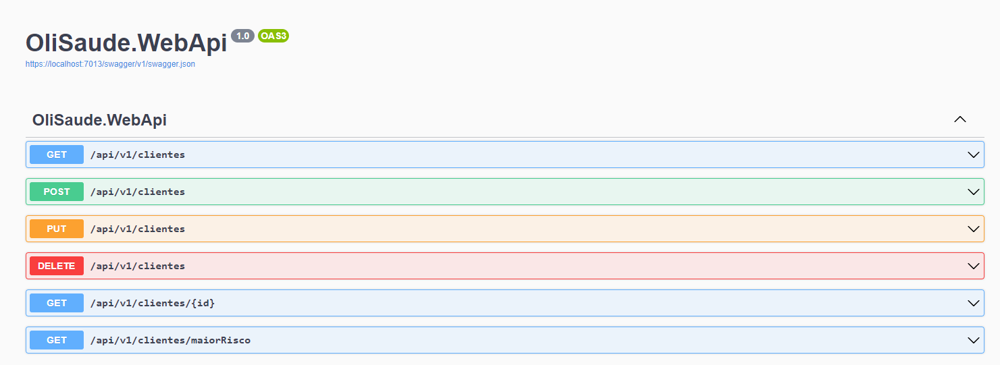

# Backend Developer Challenge

## Introdução

De Formas a testar meu conhecimento em desenvolvimento de API, alinhei no presente desafio que consiste em Desenvolver uma API de saude denominado OLisaude.

## Modelo de dados

### Cliente

- Nome: Nome do cliente
- DataNascimento: data de nascimento do cliente
- Sexo: sexo do cliente
- ProblemaDeSaude: problemas de saude do Cliente
- DataCriacao: data de criação
- DataActualizacao: data de atualização

### Problema de Saude

- Nome: nome do problema
- Grau: Grau do problema

## Funcionalidades

- Cliente: Operações CRUD para gerenciar informações o Cliente.

## EndPoints da API

### Cliente

- GET /api/v1/clientes : Opter todos os cliente

* GET /api/v1/clientes/{id} : opter um cliente por Id

* GET /api/v1/clientes/maiorRiscos : Opter os 10 clientes com maior risco

* POST /api/v1/clientes : Criar um novo cliente

* PUT /api/v1/clientes :Actualizar um cliente

* DELETE /api/v1/clientes : Remover um cliente

## como usar

- Clone este repositório.

- Configure o ambiente de desenvolvimento e as dependências necessárias.

- Execute a aplicação.

- Comece a utilizar as funcionalidades da API.

* Acesse a documentação da API (Swagger) para entender as rotas e funcionalidades disponíveis.

## Tecnologias Usadas

- .NET 7.

- Asp.Net Core 7.

- Entity Framework core.

- SQLite.

- CQRS.

- AutoMapper.

- Clean Architecture.

* MediatR.

* Minimal API.
